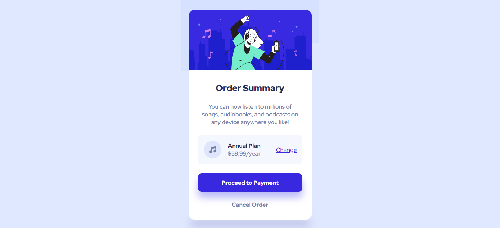

<h1 align="center">
  🎵 Order Summary Card
</h1>

## 📋 Sobre

  O projeto foi desenvolvido ultilizando um modelo disponibilizado pelo site <a href="https://www.frontendmentor.io/">Frontend Mentor </a> e foi um desafio com o objetivo de aprender mais sobre html e css.
  
  <h1>
    
  </h1>

  <h3 align="center">
    <a target="_blank" href="https://erickhenri.github.io/orderSummaryCard/"> Acesse o Site </a>
  </h3>

---

## 💻 Tecnologias Ultilizadas

- HTML
- CSS

---

Feito com 💙 por Érick Henrique.
